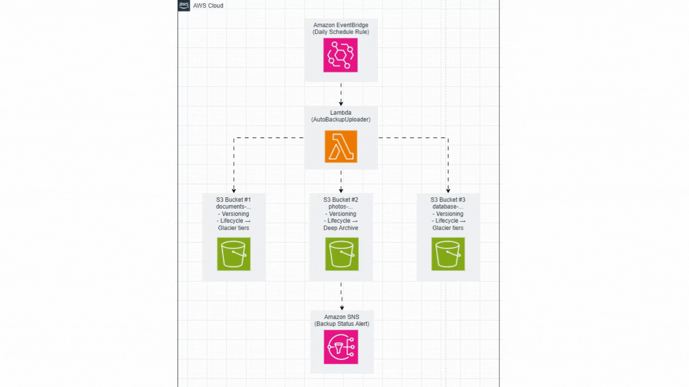

# Automatic Backup System – AWS Lambda & S3

This project demonstrates how to automatically back up files to S3, with SNS notifications and CloudWatch logging, all using **AWS Free Tier** services.  
It includes Lambda automation, S3 buckets with lifecycle rules, and email notifications for completed backups.

---

## Architecture Overview



---

## Deployed Backup System Preview

The system automatically uploads timestamped backup files to **three S3 buckets**:  

- `documents-backup-cloudwithpaula`  
- `photos-backup-cloudwithpaula`  
- `database-backup-cloudwithpaula`  

Example backup files generated by Lambda:  
- `backup_2025-10-09_01-44-29.txt` for documents, photos, and database  

---

## AWS Services Used

- **AWS Lambda** – Runs the `AutoBackupUploader` function to back up files automatically  
- **Amazon S3** – Stores backup files with versioning and lifecycle rules for Glacier/Deep Archive  
- **Amazon EventBridge (CloudWatch Scheduler)** – Triggers the Lambda function daily  
- **Amazon SNS** – Sends email notifications on backup success/failure  
- **CloudWatch Logs** – Monitors Lambda executions and logs any errors  

---

## Example Backup Behavior

- **Daily scheduled backup** triggered at the configured time (UTC or local time)  
- Each bucket has **versioning** enabled to preserve file history  
- **Lifecycle rules** move files to Glacier or Deep Archive after configured days:  
  - Documents: Glacier after 30 days, Deep Archive after 180 days  
  - Photos: Glacier after 30 days, Deep Archive after 180 days  
  - Database: Glacier after 7 days  
> For **demonstration purposes**, these transitions are temporarily set to **1 day** so the behavior can be observed immediately during the project demo  

---

## Step-by-Step Setup Summary

### 1️⃣ Create S3 Buckets
- Create three buckets for `documents`, `photos`, and `database`  
- Enable **versioning**  
- Configure **lifecycle rules** to move older backups to Glacier/Deep Archive  

### 2️⃣ Configure Lambda Function
- Use the existing Lambda function: **AutoBackupUploader**  
- Ensure the runtime is **Python 3.12**  
- Attach an IAM role with **AmazonS3FullAccess** (and **AmazonSNSFullAccess** for notifications)
- The function automatically uploads backup files from the local environment to all three S3 buckets  


### 3️⃣ Create EventBridge Rule
- Schedule type: **Rate-based schedule**  
- Frequency: **1 day**  
- Target: **AutoBackupUploader Lambda**  
- Enables automated daily backups  

### 4️⃣ SNS Notifications
- Configure Lambda to send success/failure alerts via SNS

### 5️⃣ Test & Verify
- Run Lambda manually via **“Test”** to confirm files are uploaded to all three buckets  
- Monitor execution and logs in **CloudWatch**  

---

## Design Decisions

- **Daily backup schedule:** Balances automation with cost-efficiency and ensures consistent backup without excessive S3/Lambda usage  
- **Lifecycle rules:** Normally, S3 transitions to **Glacier** or **Deep Archive** after longer periods (7–180 days). For demonstration, these transitions are set to **1 day** so the automated backup behavior can be observed immediately  
- **SNS notifications:** Demonstrates event-driven alerting  
- **Versioning enabled:** Ensures historical backups are preserved and not accidentally overwritten  

---

## Repository Structure

```plaintext
automatic-backup-system/
│
├── README.md                       ← this documentation
├── architecture-diagram.gif        ← architecture image
├── lambda_function.py              ← deployed Lambda function
├── sample-backups/                 ← test files 
│   ├── db_backup_test.sql
│   ├── test_document.txt
│   ├── photos_sample.jpg
└── screenshots/                     ← project screenshots
    ├── scr_cloudwatchlog.png
    ├── scr_database.png
    ├── scr_documents.png
    ├── scr_email.png
    ├── scr_handler.png
    ├── scr_permission.png
    └── scr_photo.png
```
---
### Author 
---
**Paula Kim** 
Cloud & AI Enthusiast
